# Radix - Ultrasound Clinical Reporting & Workflow Platform

Radix is an enterprise clinical reporting and ultrasound worksheet workflow platform engineered for modern radiology clinics, sonographers, and reading physicians. It combines real-time smart dictation, organ-specific dynamic worksheets, ACR-guardrailed AI reporting, integrated PACS/DICOM viewing, and HL7 v2 transmission into a unified, high-performance clinical workspace.

---

## Visual Tour & Workspace Screenshots

### 1. Sonographer Clinical Workspace
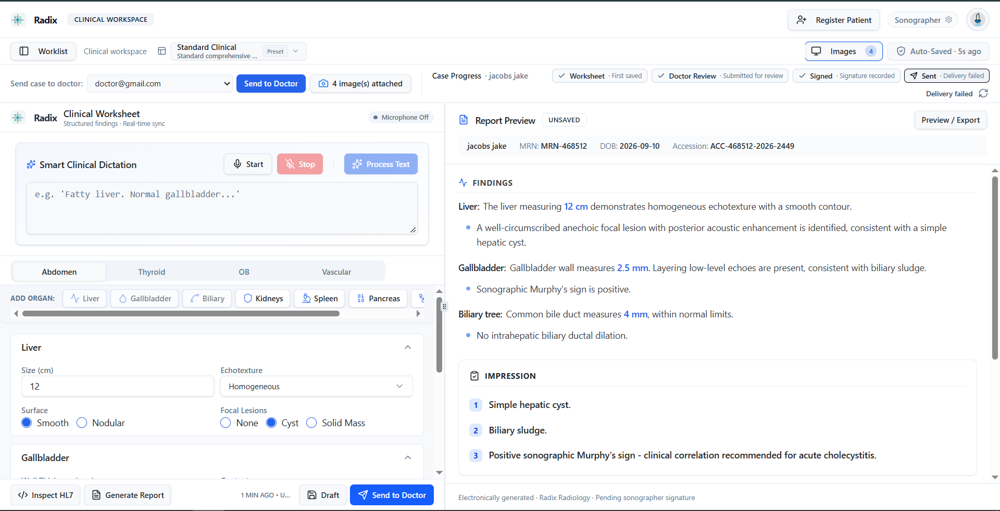
*Real-time smart clinical dictation with speech recognition, dynamic organ-specific worksheet controls (Liver, Gallbladder, Biliary, Kidneys, Spleen, Pancreas), and synchronized live report preview.*

---

### 2. Doctor Clinical Review & Sign-Off
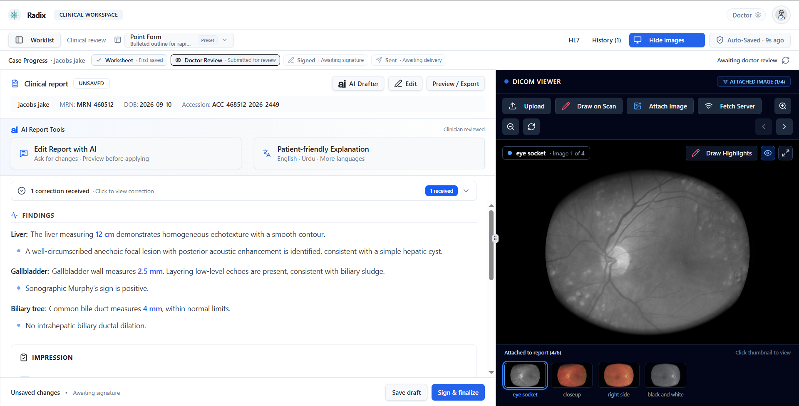
*Reading physician review interface featuring longitudinal Case Progress tracking, field-level correction request notifications, AI report enhancement tools, digital sign-off controls, and attached DICOM imaging.*

---

### 3. AI Clinical Report Drafter
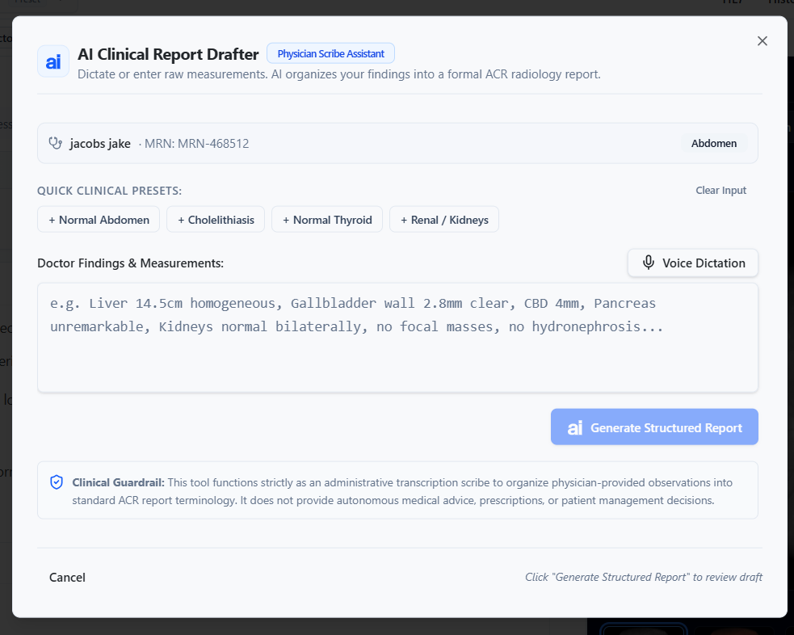
*Physician scribe assistant with instant clinical presets (+ Normal Abdomen, + Cholelithiasis, + Normal Thyroid, + Renal / Kidneys), hands-free voice dictation, and strict ACR radiology guardrails.*

---

### 4. Conversational AI Report Editing
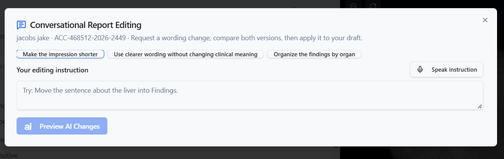
*Interactive report refinement allowing physicians to request wording changes, condense impressions, re-order anatomical sections, and preview diffs before applying them to drafts.*

---

### 5. Multilingual Patient-Friendly Explanations
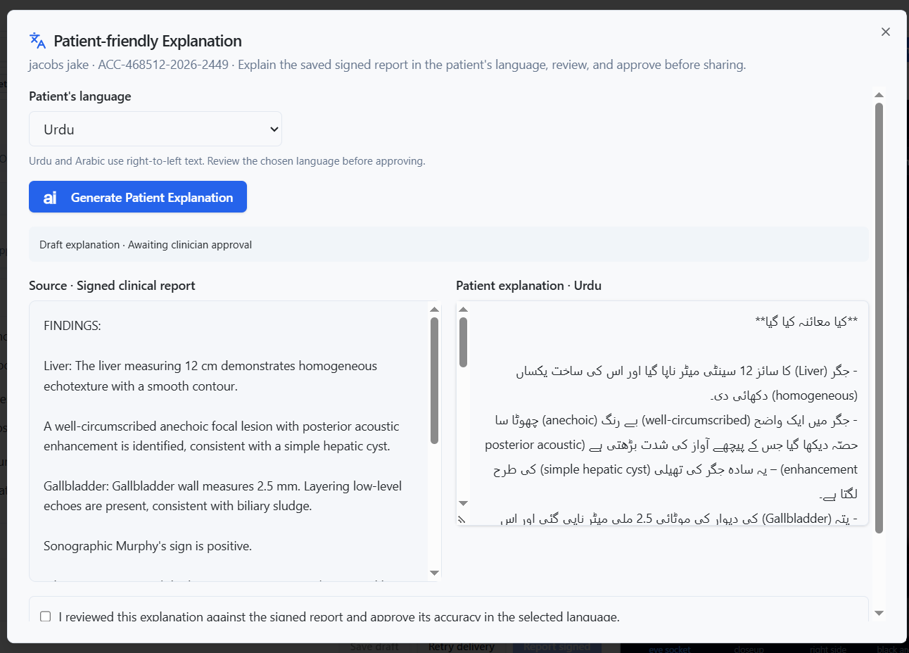
*Clinician-reviewed translations and simplified explanations of signed reports in English, Urdu, Arabic, and Spanish, featuring right-to-left typography and mandatory clinician approval before sharing.*

---

### 6. High-Resolution DICOM & PACS Viewer
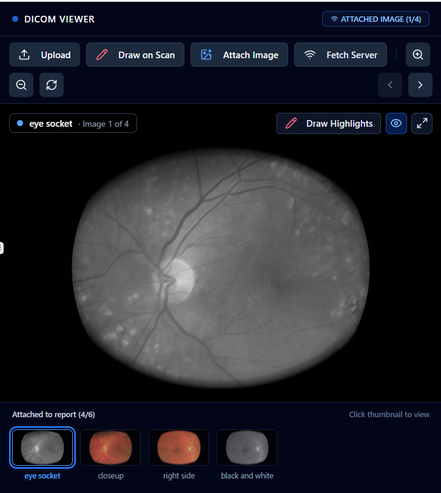
*High-resolution medical imaging viewer with window/level presets, pan, zoom, freehand drawing highlights, and key frame attachment directly into final reports.*

---

### 7. Standardized Report Formats & PDF Export
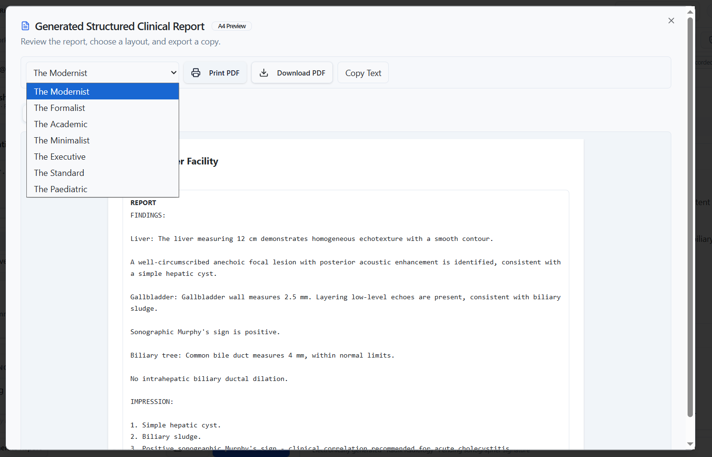
*A4 clinical report preview supporting customizable design presets (The Modernist, The Formalist, The Academic, The Minimalist, The Executive, The Standard, The Paediatric) with instant print and vector PDF download.*

---

### 8. Patient Intake & Study Ordering
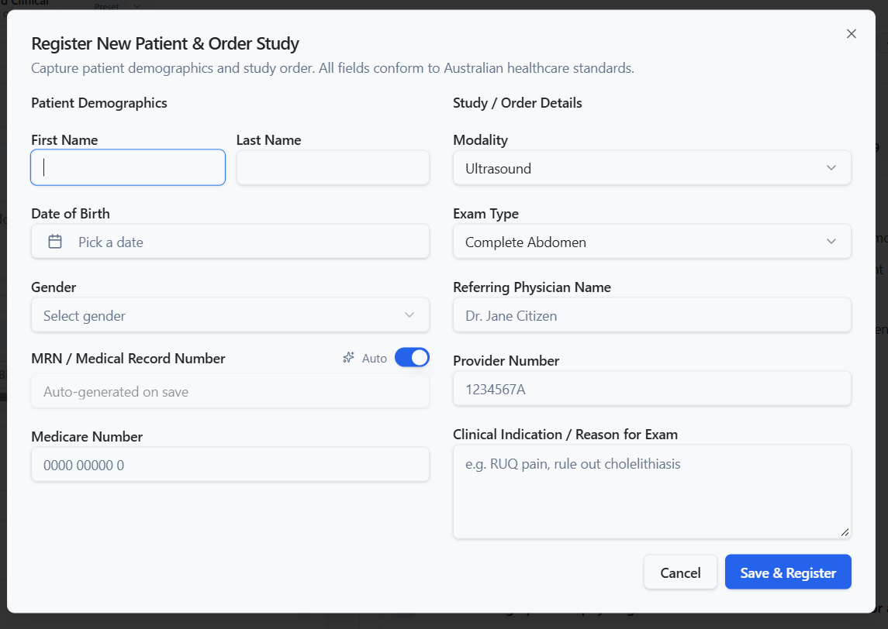
*Standardized patient registration modal capturing demographics, Medicare / MRN identifiers, study modalities, referring physician information, and clinical indications.*

---

### 9. Daily Summary & Clinical Worklist
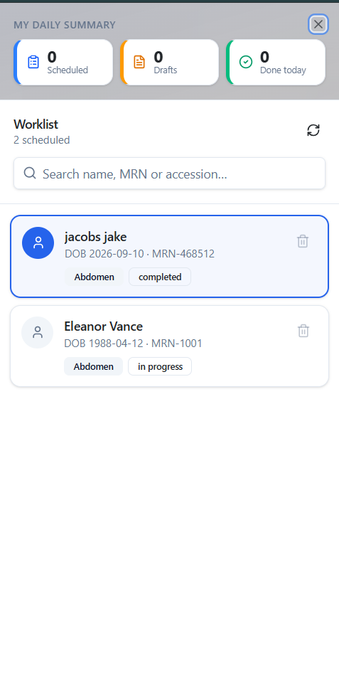
*Clinic worklist drawer displaying scheduled, in-progress, and completed studies alongside fast search by patient name, MRN, or accession number.*

---

### 10. Workstation Settings & Clinical Preferences
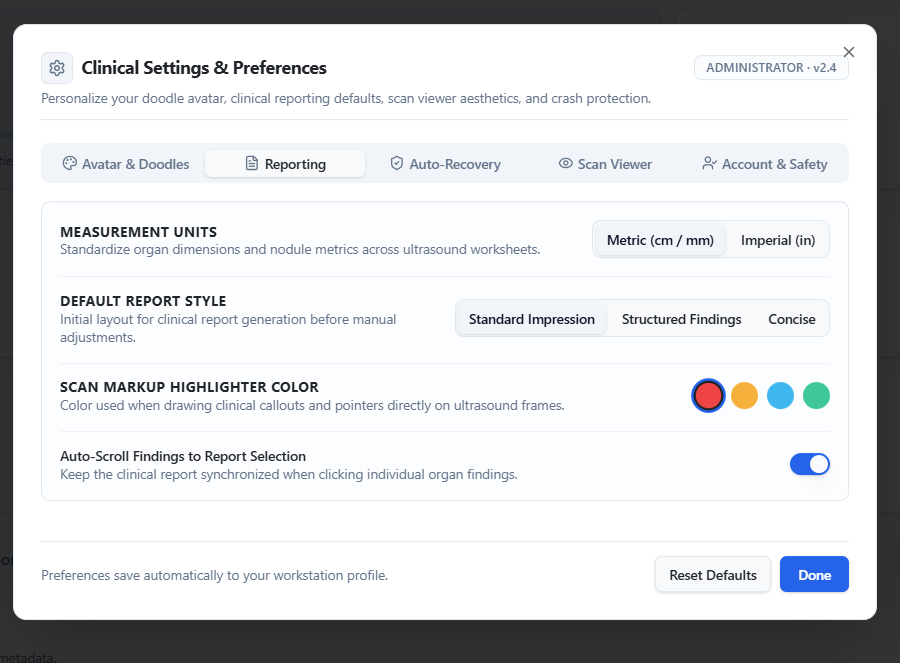
*Comprehensive workstation customization including measurement unit toggles (Metric vs Imperial), default report styling, scan markup highlighter colors, and auto-scrolling findings.*

---

### 11. Administrative Dashboard & Operational Governance
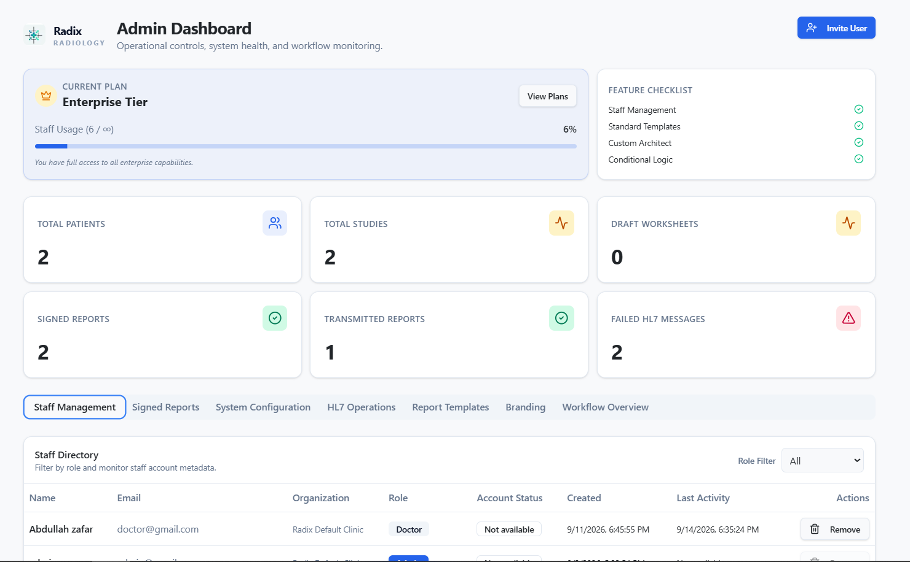
*Operational governance console tracking clinic-wide metrics (Total Patients, Studies, Signed Reports, HL7 Messages), staff directory role controls, subscription tiers, and system health.*

---

### 12. Secure Clinician Authentication Gateway
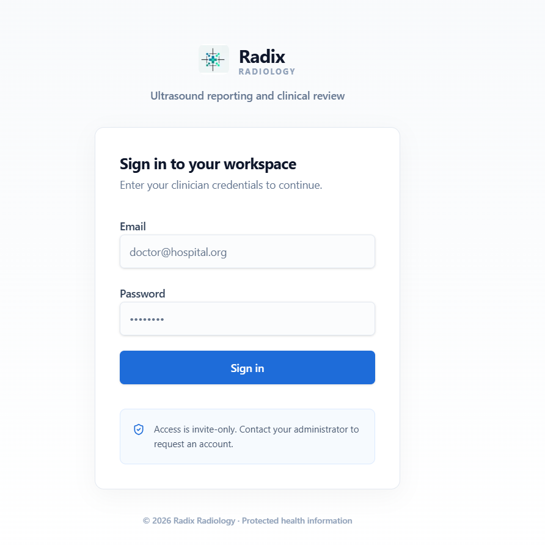
*HIPAA-compliant, role-gated authentication gateway protecting clinic data and private health records.*

---

## About Radix

Radix is a professional clinical reporting and ultrasound worksheet workflow platform designed for radiology clinics, sonographers, and reading physicians.

## Key Features

- **Role-based clinical workspace**: Dedicated administrator, doctor, radiologist, and sonographer experiences with protected authentication and organization-scoped access.
- **Patient registration and worklists**: Register patients and studies, assign cases to clinicians, open the exact submitted worksheet, and receive real-time worklist updates with polling fallback.
- **Dynamic ultrasound worksheets**: Structured Abdomen, Thyroid, Obstetric, and Vascular exams with configurable abdomen section ordering, rich measurements, TI-RADS nodule descriptors, and clinical notes.
- **Clinical validation**: Inline alerts identify missing or inconsistent values and block unsafe submission or signing when critical validation errors remain.
- **Voice-assisted data capture**: Medical dictation through Deepgram, Gladia, or browser speech recognition, with structured extraction into the active worksheet.
- **AI clinical drafting**: Generate structured findings and impressions, apply conversational report edits, compare proposed changes, and protect recorded numeric facts with clinical safety checks.
- **Patient-friendly explanations**: Create clinician-reviewed explanations in English, Urdu, Arabic, or Spanish, including right-to-left presentation and approval-gated copy/download.
- **Review and correction loop**: Doctors attach comments to exact worksheet fields and return cases; sonographers document each resolution before resubmitting.
- **DICOM viewing and key images**: Load local DICOM files or retrieve DICOMweb frames, adjust window/level, pan and zoom, then capture, annotate, caption, and include selected images in reports.
- **Structured reports and templates**: Generate branded A4 reports from organization templates, preview them, copy their text, print them, or download compressed PDFs.
- **Signing, history, and delivery**: Review and edit reports, sign and finalize them, retain report history, inspect HL7 v2 `ORU^R01`, and track transmission results.
- **Case progress tracking**: Follow Worksheet → Doctor Review → Signed → Sent with recorded timestamps, correction status, delivery failures, and clearly labeled local demo acknowledgments.
- **Multi-clinic administration**: Manage staff roles, organization tiers, branding, report templates, tenant boundaries, audit records, and operational health from the admin dashboard.
- **Production-safe demo controls**: Synthetic worklist data is opt-in and remains disabled unless explicitly enabled for a local presentation.

## Doctor AI Report Assistant

Radix features an intelligent, guardrailed AI Clinical Drafter built directly into the doctor's review and sign-off workflow:

- **Intelligent Report Generation**: Instantly transform raw findings, measurements, and clinical observations into comprehensive, structured radiology reports (Technique, Findings by organ/system, and Impression).
- **Hands-Free Voice Dictation**: Live microphone dictation powered by speech recognition enables doctors to verbally capture observations hands-free.
- **ACR Guardrails & Clinical Safety**: Powered by high-throughput Groq LLM inference configured with strict radiology transcription guardrails to ensure factual accuracy and prevent hallucinations.
- **Clinical Presets & Quick Templates**: Built-in standardized templates for common exams (e.g., Normal Abdomen, Cholelithiasis, Thyroid, Renal) for rapid drafting.
- **Full Physician-in-the-Loop Control**: Physicians maintain total autonomy to review, edit, refine, and digitally sign reports before final archiving or HL7 transmission.

## AI Report Tools

The workspace also shows **Case Progress** above the clinical panels: Worksheet → Doctor Review → Signed → Sent. It follows saved worksheets, review submissions, signatures, and delivery records, displaying recorded timestamps when available. Local mock acknowledgments are labeled **Demo sent**. The tracker refreshes after workflow actions, on window focus, and every 30 seconds while visible; a refresh button is also available. Run status-transition checks with `npm run test:workflow`.

The doctor report panel includes two labeled buttons using the existing application theme:

- **Edit Report with AI** opens conversational editing with quick instructions, optional browser voice input, and a side-by-side before/after preview. Numeric facts are checked in code, followed by an AI clinical-meaning check. The clinician reviews the proposal before applying it to the draft; this does not sign the report.
- **Patient-friendly Explanation** generates an explanation of the saved signed report in English, Urdu, Arabic, or Spanish. Urdu and Arabic use right-to-left text. A clinician can edit the explanation, compare it with the source, and approve it before copy or UTF-8 text download becomes available. Changing the explanation or language clears approval.

These tools use the existing server-side `GROQ_API_KEY` or `OPENAI_API_KEY` configuration and optional model environment variables. The `/api/report/copilot` endpoint requires a signed-in doctor or radiologist. Explanations require a saved signed worksheet in the clinician's organization. Approvals record the reviewer, language, source hash, explanation text, and approval time in the existing `audit_logs` table; sharing stays disabled if recording approval fails. No new database migration is needed if the existing workflow migrations have been applied.

For a demo, open a case in doctor mode, select **Edit Report with AI**, choose **Make the impression shorter**, then preview and apply. After signing the report, select **Patient-friendly Explanation**, choose a language, generate, review, and approve. Copy/download prepares the explanation for the clinic's usual sharing process; it does not automatically send a message to the patient. Close/reopen starts a fresh explanation review; approved copies remain recorded in the audit log.

Run focused validation with `npm run test:report-ai`. AI checks assist review and do not guarantee clinical equivalence or translation accuracy.

## Key Images and Correction Workflow

- Doctors and radiologists can capture the active DICOM frame, add freehand clinical markup and a caption, and select up to six key images. The selected images stay with the worksheet and appear beside the findings in live previews, A4 exports, and signed-report history PDFs.
- Reviewers can attach correction requests to exact worksheet fields and return a case to its sonographer. Sonographers see every request in the report workspace, record how each item was addressed, and must resolve all open requests before resubmitting.
- Returned cases use the `correction_requested` study status and are recorded in the audit log. Apply `supabase/migrations/20260906010000_key_images_and_correction_workflow.sql` so assigned reviewers can persist review metadata within the existing organization boundaries.

Synthetic worklist data is disabled by default. For a local presentation only, set `NEXT_PUBLIC_ENABLE_DEMO_DATA=true`; keep it false for shared or production environments.

## Tech Stack & Architecture

- **Frontend & Framework**: [Next.js](https://nextjs.org/) (App Router, Turbopack, React 19)
- **Styling & UI**: [Tailwind CSS](https://tailwindcss.com/), Radix UI Primitives, Lucide Icons, Shadcn UI
- **Database & Authentication**: [Supabase](https://supabase.com/) (PostgreSQL, Row-Level Security, Session & Role Management)
- **AI Clinical Scribe**: [Groq](https://groq.com/) Cloud LLMs (`openai/gpt-oss-120b`) with ACR radiology transcription guardrails
- **Medical Dictation (STT)**: [Deepgram](https://deepgram.com/) Medical Speech API + Web Speech API for real-time transcription
- **Medical Imaging (PACS)**: Cornerstone.js & DICOMweb viewer (Window/Level, Zoom, Pan, Cine playback)
- **Clinical Interoperability**: HL7 v2.x (`ORU^R01`) export and transmission engine
- **Deployment**: [Vercel](https://vercel.com/) (Production Serverless & Edge Network)
